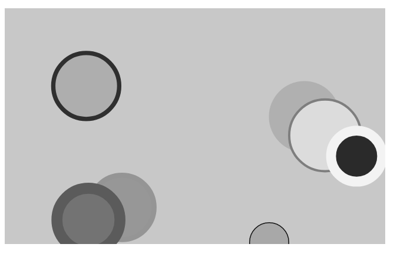

# CLJS Shadow Quil



# Start in 1 minute

```
git clone ...
npm install 
npx shadow-cljs watch app2
# the browse to http://localhost:8080
```

# Manually get started

Create a new project

```
npx create-cljs-project acme-app
```

Add Clojure dependencies to **shadow-cljs.edn**:

```
[quil "3.0.0"]
```

Install externally required JS dependencies

```
npm install 
# or
npm install p5
```

Start the shadow-cljs development watcher

```
npx shadow-cljs watch app2
```


# Release

```
npx shadow-cljs release app2
```

# Other Links

http://shadow-cljs.org/
https://github.com/thheller/shadow-cljs
https://github.com/shadow-cljs/examples
https://medium.com/@jiyinyiyong/a-beginner-guide-to-compile-clojurescript-with-shadow-cljs-26369190b786
https://github.com/quil/quil/wiki/ClojureScript